# Elastic Path to Plasmic Entity Mapping Report

## Executive Summary

This report outlines the recommended approach for mapping Elastic Path's organizational structure (Organizations, Stores, and Users) to Plasmic's entity model (Teams, Workspaces, and Users). The proposed mapping enables seamless integration while maintaining the flexibility of Elastic Path's multi-tenant architecture.

## Entity Relationship Overview

### Elastic Path Model

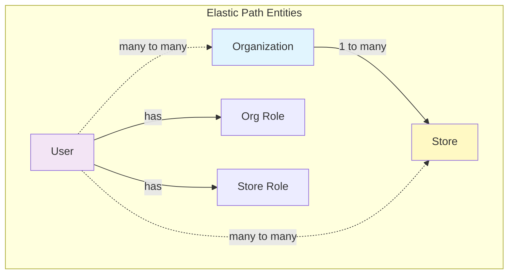

### Plasmic Model Mapping

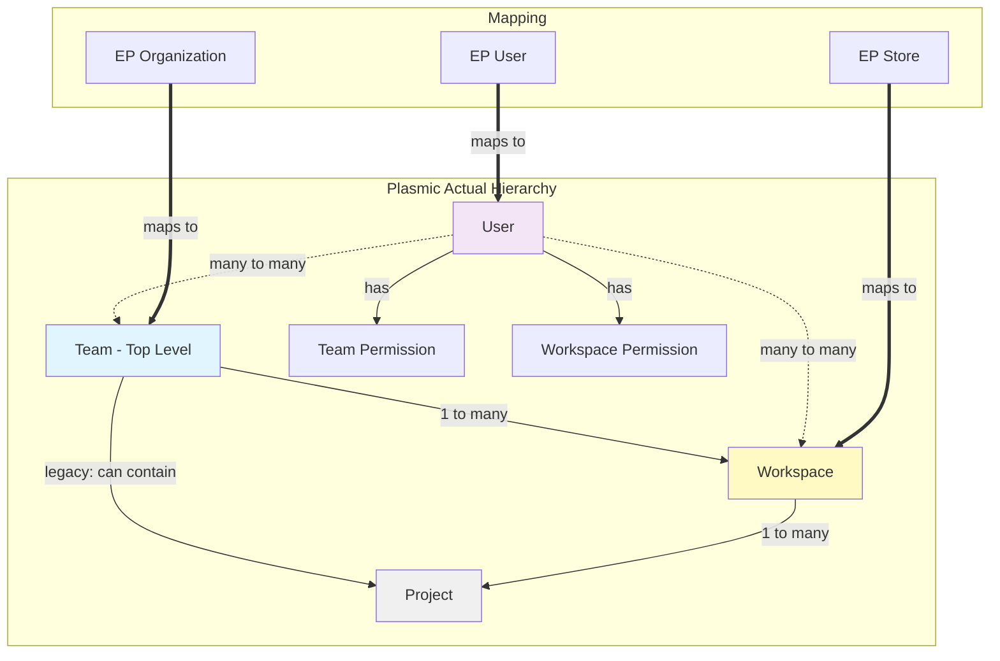

**Critical Understanding: "Organizations" in Plasmic UI = Teams in Backend**

While Plasmic's codebase contains a legacy `Org` entity, the term "Organization" you see in the Plasmic UI actually refers to the `Team` entity:

- **UI shows**: "Organization", "Manage Organization", `/orgs/:id` routes
- **Backend uses**: `Team` entity, `teams` table, Team-based logic
- **Why**: This is a labeling decision - Teams are presented as "Organizations" to users

The actual `Org` entity in the database is **completely unused**. When users interact with "Organizations" in Plasmic, they are actually working with Teams.

**For integration purposes**:

- When Plasmic documentation or UI mentions "Organization" → it means `Team` entity
- When mapping from Elastic Path → use EP Organization → Plasmic Team

## Detailed Entity Mapping

### Core Mappings

| Elastic Path Entity | Plasmic Entity       | Notes                               |
| ------------------- | -------------------- | ----------------------------------- |
| Organization        | Team                 | One-to-one mapping                  |
| Store               | Workspace            | Optional - only created when needed |
| User                | User                 | Shared across organizations         |
| Org Role            | Team Permission      | Role-based access at org level      |
| Store Role          | Workspace Permission | Store-specific access overrides     |

**Note on Enterprise Hierarchies**: For complex organizational structures, Plasmic supports parent-child Team relationships. This allows creating team hierarchies like:

- Parent Team: "ACME Corp Global"
  - Child Team: "ACME Corp US"
  - Child Team: "ACME Corp EU"

This can be useful if Elastic Path has regional or divisional organization structures.

### Permission Mapping

| EP Role   | Team Permission | Workspace Permission | Description             |
| --------- | --------------- | -------------------- | ----------------------- |
| Admin     | Owner           | Owner                | Full control            |
| Developer | Editor          | Editor               | Can modify designs      |
| Content   | -               | Content              | Content management only |
| Viewer    | Viewer          | Viewer               | Read-only access        |

## Architecture Flow

### Authentication & Provisioning Flow

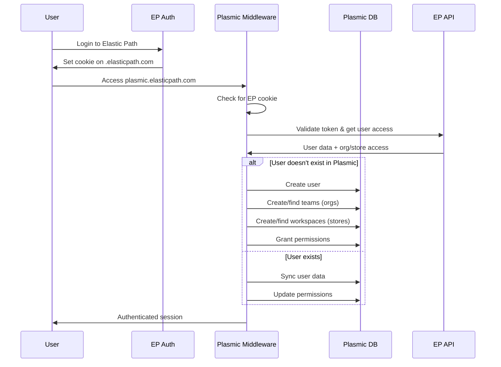

### Permission Inheritance Model

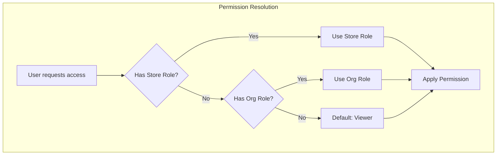

## Implementation Architecture

### Component Overview

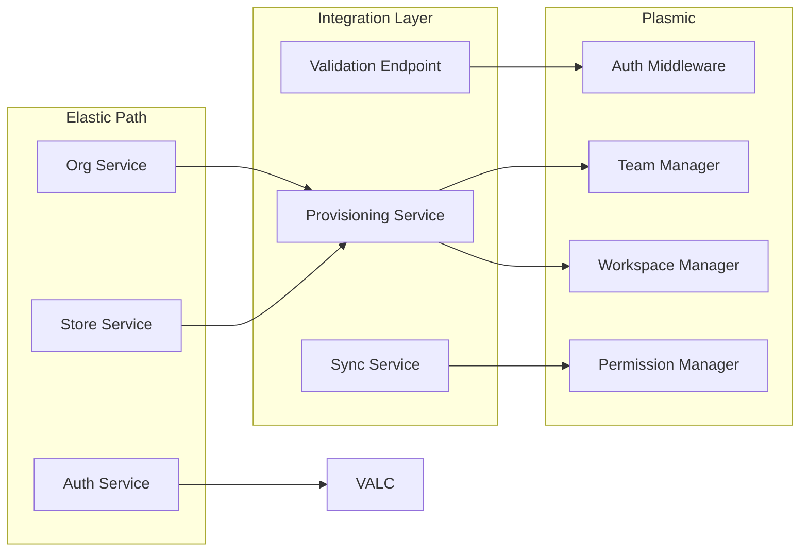

## Data Synchronization Strategy

### Initial Provisioning

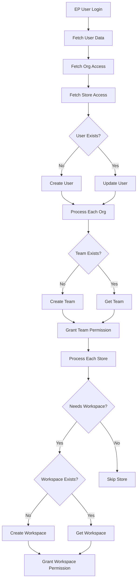

### Ongoing Synchronization

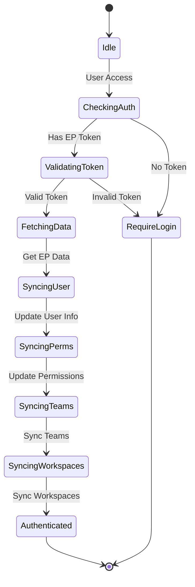

## Key Features

### 1. Multi-Organization Support

Users can belong to multiple organizations with different roles:

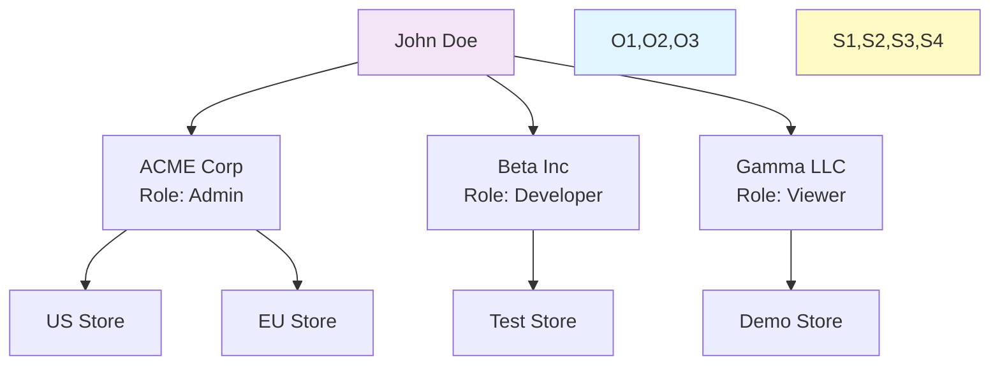

### 2. Store-Level Workspace Creation

Not all stores require Plasmic workspaces. They are created on-demand:

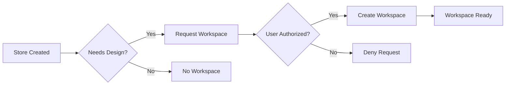

### 3. Permission Cascading

Organization-level permissions cascade to stores unless overridden:

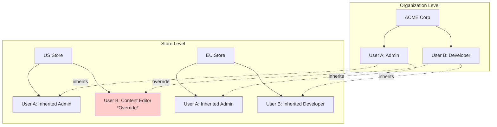

## Implementation Recommendations

### Phase 1: Foundation (Weeks 1-2)

- Set up shared domain cookies
- Implement validation endpoint
- Create basic provisioning logic

### Phase 2: Entity Mapping (Weeks 3-4)

- Implement organization → team mapping
- Implement store → workspace mapping
- Set up permission mapping

### Phase 3: Advanced Features (Weeks 5-6)

- On-demand workspace creation
- Permission inheritance logic
- Cross-store collaboration

### Phase 4: Optimization (Weeks 7-8)

- Caching strategies
- Bulk synchronization
- Performance tuning

## Security Considerations

### Token Flow Security

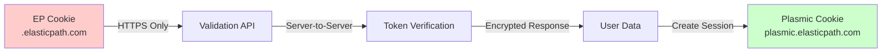

### Data Privacy

- User data synchronized only as needed
- Minimal data storage in Plasmic
- Audit trail for all provisioning events
- Encrypted storage of external IDs

## Benefits of This Approach

1. **Seamless SSO**: Users authenticate once with Elastic Path
2. **Flexible Structure**: Supports complex organizational hierarchies
3. **Granular Permissions**: Store-level overrides when needed
4. **Scalable**: Handles users with multiple organization memberships
5. **On-Demand Resources**: Workspaces created only when needed
6. **Maintainable**: Clear separation of concerns

## Potential Challenges & Mitigations

| Challenge           | Impact                           | Mitigation                     |
| ------------------- | -------------------------------- | ------------------------------ |
| Permission Sync Lag | Users may have stale permissions | Implement real-time webhooks   |
| Complex Hierarchies | Difficult to visualize           | Custom UI for EP structure     |
| Store Proliferation | Too many workspaces              | Workspace archiving strategy   |
| Cross-Org Isolation | No sharing between orgs          | Intentional - security feature |

## Conclusion

The proposed entity mapping provides a robust foundation for integrating Elastic Path's multi-tenant commerce platform with Plasmic's visual design system. The architecture maintains the flexibility of both systems while providing a seamless user experience and appropriate security boundaries.

Key success factors:

- Automatic user provisioning reduces friction
- Permission inheritance simplifies management
- On-demand workspace creation optimizes resources
- Clear entity mapping ensures consistency

This approach scales from small single-store merchants to large multi-national organizations with complex permission requirements.
