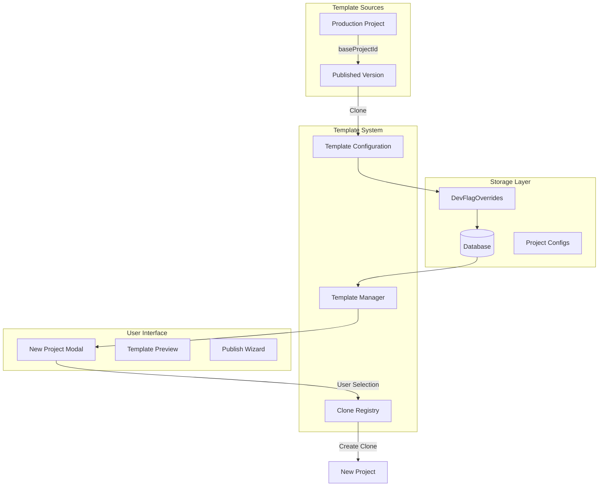

# Plasmic Starter Templates: Complete Architecture and Implementation Guide

## Table of Contents
1. [Overview](#overview)
2. [Architecture](#architecture)
3. [Key Concepts](#key-concepts)
4. [Template Configuration Structure](#template-configuration-structure)
5. [Creating Templates from Production Projects](#creating-templates-from-production-projects)
6. [Template Management](#template-management)
7. [Deployment and Distribution](#deployment-and-distribution)
8. [Best Practices](#best-practices)
9. [Troubleshooting](#troubleshooting)

## Overview

Starter templates in Plasmic are pre-configured projects that users can clone to quickly start building. They appear in the "New Project" modal and provide a foundation for common use cases like landing pages, e-commerce sites, or dashboards.

### Key Benefits
- **Quick Start**: Users can begin with a working example
- **Best Practices**: Templates demonstrate proper Plasmic patterns
- **Customization**: Each clone is independent and fully customizable
- **Learning**: Templates serve as educational resources

## Architecture

### System Components



### Data Flow

1. **Template Definition**: Production projects are identified and configured as templates
2. **Storage**: Template configurations are stored in DevFlagOverrides
3. **Discovery**: Template manager reads configurations from the database
4. **Display**: Templates appear in the New Project modal organized by sections
5. **Cloning**: When selected, the system clones the template project
6. **Customization**: Users get their own copy to modify

## Key Concepts

### 1. **Project Types**

- **Source Project**: The original production project
- **Base Project**: The published version used as template source
- **Template Configuration**: Metadata that makes a project available as a template
- **Cloned Instance**: User's copy of the template

### 2. **Project ID vs Base Project ID**

```typescript
interface ProjectReference {
  // Direct clone - includes unpublished changes
  projectId?: string;
  
  // Published version clone - stable, recommended for templates
  baseProjectId?: string;
}
```

- **projectId**: Clones the current state including all branches and unpublished changes
- **baseProjectId**: Clones only the latest published version, ensuring stability

### 3. **DevFlagOverrides**

The template system uses Plasmic's DevFlagOverrides mechanism to store and distribute template configurations. This allows:
- Dynamic template updates without code deployment
- A/B testing different template sets
- Environment-specific template availability

## Template Configuration Structure

### StarterProjectConfig

```typescript
interface StarterProjectConfig {
  // Display name shown in the template card
  name: string;
  
  // Project reference (use one)
  projectId?: string;        // Current state clone
  baseProjectId?: string;    // Published version clone (recommended)
  
  // Unique identifier for the template
  tag: string;
  
  // Description shown in the template card
  description: string;
  
  // Attribution (optional)
  author?: string;
  authorLink?: string;
  
  // Visual customization
  iconName?: string;         // Icon component name
  imageUrl?: string;         // Preview image URL
  highlightType?: "first" | "second" | "third"; // Visual emphasis
  
  // External link instead of template (rare)
  href?: string;
  
  // User experience options
  publishWizard?: boolean;   // Show publish wizard on first open
  showPreview?: boolean;     // Enable /templates/{tag} preview
  
  // Global context configuration
  globalContextConfigs?: StarterGlobalContextConfig[];
  
  // Access control
  isPlasmicOnly?: boolean;   // Internal templates only
}
```

### StarterSectionConfig

```typescript
interface StarterSectionConfig {
  // Section heading in the modal
  title: string;
  
  // Unique section identifier
  tag: string;
  
  // Templates in this section
  projects: StarterProjectConfig[];
  
  // UI elements
  infoTooltip?: string;      // Help tooltip
  docsUrl?: string;          // Documentation link
  moreUrl?: string;          // Additional resources
  
  // Access control
  isPlasmicOnly?: boolean;
}
```

### Example Configuration

```typescript
const landingPageSection: StarterSectionConfig = {
  title: "Landing Pages",
  tag: "landing-pages",
  infoTooltip: "Professional landing page templates",
  docsUrl: "https://docs.plasmic.app/templates/landing-pages",
  projects: [
    {
      name: "SaaS Landing Page",
      baseProjectId: "abc123",
      tag: "saas-landing",
      description: "Modern SaaS product landing page with pricing",
      author: "Plasmic Team",
      imageUrl: "https://s3.../saas-landing-preview.png",
      highlightType: "first",
      publishWizard: true,
      showPreview: true,
      globalContextConfigs: [
        {
          name: "Theme",
          props: [
            { name: "primaryColor", value: "#0070f3" },
            { name: "darkMode", value: "false" }
          ]
        }
      ]
    }
  ]
};
```

## Creating Templates from Production Projects

### Step 1: Identify and Prepare Source Project

1. **Choose a Production Project**
   - Ensure it's well-structured and follows best practices
   - Remove any sensitive data or API keys
   - Test all functionality

2. **Publish the Project**
   ```bash
   # In Plasmic Studio, publish your project
   # Note the project ID from the URL: /projects/PROJECT_ID
   ```

### Step 2: Clone the Project (Optional)

If you want to create a separate template version:

```bash
# Clone from production
yarn node-scripts platform/wab/scripts/clone-project-from-production.ts \
  PROJECT_ID \
  --token YOUR_PLASMIC_TOKEN \
  --workspace TARGET_WORKSPACE_ID
```

### Step 3: Create Template Configuration

1. **Create configuration file** (`my-template-config.ts`):

```typescript
import { StarterProjectConfig } from "@/wab/shared/devflags";

export const myTemplateConfig: StarterProjectConfig = {
  name: "E-commerce Storefront",
  baseProjectId: "YOUR_PROJECT_ID",
  tag: "ecommerce-storefront",
  description: "Full-featured online store with product catalog, cart, and checkout",
  author: "Your Team",
  authorLink: "https://yourcompany.com",
  imageUrl: "https://your-s3-bucket.com/ecommerce-preview.png",
  highlightType: "first",
  publishWizard: true,
  showPreview: true,
  globalContextConfigs: [
    {
      name: "StoreConfig",
      props: [
        { name: "storeName", value: "My Store" },
        { name: "currency", value: "USD" }
      ]
    }
  ]
};
```

### Step 4: Add to Starter Templates

1. **Using the add-to-starter-templates script**:

```typescript
// In /temp/add-to-starter-templates.ts
import { myTemplateConfig } from "./my-template-config";

const config = {
  section: "e-commerce", // or create new section
  template: myTemplateConfig
};

// Run the script
// yarn node-scripts temp/add-to-starter-templates.ts
```

2. **Or manually update DevFlagOverrides**:

```typescript
const updatedStarterSections = [
  ...existingStarterSections,
  {
    title: "E-commerce",
    tag: "e-commerce",
    projects: [myTemplateConfig]
  }
];

// Update in database via admin interface or script
```

### Step 5: Upload Preview Image

```bash
# Upload to S3 or CDN
aws s3 cp template-preview.png s3://plasmic-templates/ecommerce-preview.png --acl public-read
```

### Step 6: Test the Template

1. Clear your local cache
2. Open Plasmic Studio
3. Click "New Project"
4. Find your template in the appropriate section
5. Create a project from the template
6. Verify all functionality works correctly

## Template Management

### Listing Current Templates

```bash
# Extract current production templates
yarn node-scripts platform/wab/scripts/extract-production-starters.js

# Output will show all configured templates
```

### Bulk Template Operations

```bash
# Clone multiple templates at once
yarn node-scripts platform/wab/scripts/clone-starter-templates.ts \
  --config extracted-starters.json \
  --workspace TARGET_WORKSPACE_ID
```

### Updating Templates

1. **Update Source Project**: Make changes in the original project
2. **Publish Changes**: Publish to update the base version
3. **Clear Cache**: Template updates may require cache clearing
4. **Version Management**: Consider maintaining version history

### Removing Templates

```typescript
// Remove from starterSections array in DevFlagOverrides
const updatedSections = starterSections.filter(
  section => section.projects.filter(
    project => project.tag !== "template-to-remove"
  )
);
```

## Deployment and Distribution

### 1. **Environment Configuration**

Templates can be environment-specific:

```typescript
const devTemplates = process.env.NODE_ENV === 'development' 
  ? [devOnlyTemplate] 
  : [];

const starterSections = [
  ...productionTemplates,
  ...devTemplates
];
```

### 2. **Access Control**

```typescript
// Internal only templates
{
  isPlasmicOnly: true, // Only visible to Plasmic team
}

// User tier restrictions (custom implementation needed)
{
  requiredTier: "enterprise",
}
```

### 3. **Geographic Distribution**

Consider CDN distribution for preview images:
- Use CloudFront or similar CDN
- Implement geographic fallbacks
- Optimize image sizes

### 4. **Template Preview System**

When `showPreview: true`, templates are accessible at:
```
https://plasmic.app/templates/{tag}
```

This allows:
- Public template galleries
- SEO benefits
- Social sharing

## Best Practices

### 1. **Template Design**

- **Self-Contained**: Include all necessary components
- **Responsive**: Ensure mobile and desktop compatibility
- **Documented**: Add helpful comments and instructions
- **Configurable**: Use global contexts for easy customization
- **Performance**: Optimize images and minimize dependencies

### 2. **Naming Conventions**

```typescript
{
  tag: "category-specific-name",     // e.g., "ecommerce-minimal"
  name: "Human Readable Name",       // e.g., "Minimal E-commerce"
  imageUrl: "category-name-preview.png"
}
```

### 3. **Version Management**

- Always use `baseProjectId` for stability
- Document major changes in description
- Consider semantic versioning in tags
- Maintain backwards compatibility

### 4. **Testing Checklist**

- [ ] Template clones successfully
- [ ] All features work in cloned project
- [ ] No broken references or missing assets
- [ ] Global contexts apply correctly
- [ ] Publish wizard works (if enabled)
- [ ] Preview image loads correctly
- [ ] Description accurately represents template

### 5. **Maintenance**

- Regular audits of template functionality
- Update dependencies and components
- Monitor usage analytics
- Gather user feedback
- Keep documentation current

## Troubleshooting

### Common Issues

1. **Template Not Appearing**
   - Check DevFlagOverrides are saved
   - Clear browser cache
   - Verify template configuration syntax
   - Check `isPlasmicOnly` flag

2. **Clone Fails**
   - Verify project ID exists
   - Check permissions on source project
   - Ensure published version exists (for baseProjectId)
   - Check for circular dependencies

3. **Preview Image Not Loading**
   - Verify URL is publicly accessible
   - Check CORS headers on image host
   - Ensure image format is supported
   - Test URL in isolation

4. **Global Context Issues**
   - Validate context configuration syntax
   - Ensure context provider exists in project
   - Check for naming conflicts
   - Verify prop types match

### Debug Mode

Enable detailed logging:

```typescript
// In development
if (process.env.NODE_ENV === 'development') {
  console.log('Loading starter templates:', starterSections);
  console.log('Template count:', 
    starterSections.reduce((acc, s) => acc + s.projects.length, 0)
  );
}
```

### Support Resources

- Internal: Check `/platform/wab/scripts/` for utility scripts
- Logs: Monitor server logs for template-related errors
- Database: Query DevFlagOverrides for current configuration
- Analytics: Track template usage and success rates

## Conclusion

The Plasmic starter template system provides a powerful way to accelerate user onboarding and showcase platform capabilities. By following this guide, you can create, manage, and distribute templates that help users succeed with Plasmic.

Remember that templates are living artifacts - they should evolve with the platform and user needs. Regular maintenance and updates ensure templates remain valuable resources for the Plasmic community.